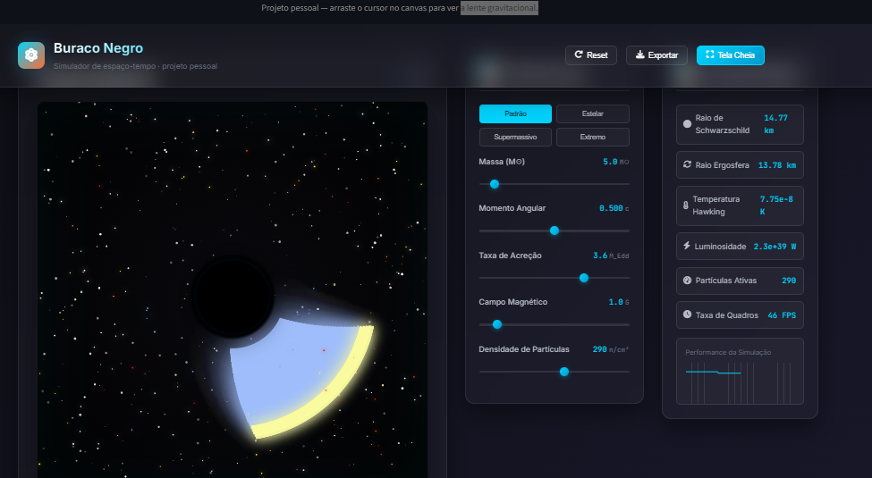

# Buraco Negro — Simulador de espaço-tempo



Projeto pessoal: simulador interativo de buraco negro em HTML5/Canvas e JavaScript, com parâmetros físicos ajustáveis e efeito de lente gravitacional.

**Victor** · [GitHub](https://github.com/Victormartinsilva/buraco-negro-simulator) · link do app no Streamlit após o deploy

---

## O que tem

- Controles: massa (M☉), spin, taxa de acreção, campo magnético, densidade de partículas
- Presets: Padrão, Estelar, Supermassivo, Extremo
- Disco de acreção, horizonte de eventos, ergosfera
- Partículas com órbitas e arraste do espaço-tempo
- Lente gravitacional ao mover o cursor sobre o canvas
- Dados em tempo real: raio de Schwarzschild, ergosfera, temperatura de Hawking, luminosidade
- Exportar PNG, gravar vídeo WebM, tela cheia

---

## Rodar localmente

```bash
pip install -r requirements.txt
streamlit run app.py
```

Ou abrir direto no navegador: `buraco-negro.html`.

---

## Subir no GitHub

1. Crie um repositório novo no GitHub (ex.: `buraco-negro-simulator`).
2. Na pasta do projeto:

```bash
git init
git add .
git commit -m "Simulador buraco negro + app Streamlit"
git branch -M main
git remote add origin https://github.com/SEU_USUARIO/buraco-negro-simulator.git
git push -u origin main
```

---

## Deploy no Streamlit Cloud

1. No [share.streamlit.io](https://share.streamlit.io), faça login com o GitHub.
2. **New app** → escolha o repositório, branch `main`, arquivo `app.py`.
3. O Streamlit usa o `requirements.txt` da raiz do repo. Deixe o **Main file path** como `app.py`.
4. Deploy. O app ficará em `https://SEU_USUARIO-buraco-negro-simulator-app-XXX.streamlit.app` (ou o nome que você der).

Se o repositório tiver só esta pasta (só este projeto), use essa pasta como **root** no Streamlit Cloud; caso o repo tenha várias pastas, aponte **App root directory** para a pasta onde estão `app.py` e `buraco-negro.html`.

---

## Estrutura

```
├── app.py              # App Streamlit (embarca o HTML)
├── buraco-negro.html   # Simulador (canvas + JS)
├── assets/
│   └── preview.png     # Screenshot do projeto
├── requirements.txt
└── README.md
```
